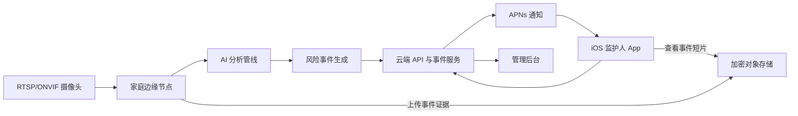

# 守望 AI（WatchCare AI）软件设计及编写方案

**文档类型：** 软件架构、开发环境与生命周期规划  
**目标平台：** iOS 首发  
**建议版本：** 1.0  
**日期：** 2026-08-03

---

## 0. 执行摘要

守望 AI 的目标不是开发一个普通摄像头播放器，而是形成一套完整的远程照护事件系统：

> 摄像头持续采集画面，家庭边缘节点执行实时 AI 分析；发现疑似跌倒、长时间倒地、危险区域进入或设备异常后，将结构化风险事件发送到服务端，再由 iOS App 通知监护人、展示证据并完成确认和升级处置。

根据现有项目资料，首版应集中完成以下四类能力：

1. 老人疑似跌倒检测；
2. 跌倒后的长时间倒地或异常静止；
3. 危险区域进入；
4. 摄像头离线、遮挡或画面冻结。

儿童复杂攀爬、噎食、癫痫、疾病发作、情绪和意图识别不应进入首版范围。现有调研显示，老人跌倒和长时间倒地具有更明确的事件定义、数据基础和处置价值；儿童场景应先从危险区域规则切入。

### 0.1 首版系统组成

| 系统 | 主要责任 |
|---|---|
| iOS 监护人 App | 账号、设备配置、风险区域设置、实时状态、事件查看、报警确认、隐私设置 |
| 家庭边缘节点 | 摄像头接入、视频解码、AI 推理、风险复核、短片生成、断网缓存 |
| 云端服务 | 用户与权限、设备管理、事件同步、报警编排、审计、模型与规则版本管理 |
| 通知服务 | APNs 推送、联系人升级、短信或电话服务接口 |
| 管理后台 | 试点设备管理、模型效果统计、故障诊断、审计和用户支持 |

### 0.2 最重要的架构限制

iOS 的后台任务由系统调度，适合刷新、维护和有限的延迟任务，不适合作为全天候视频解码及 AI 推理进程。因此，生产版本不能依赖“iPhone App 退到后台后继续监控摄像头”。

参考：Apple Developer，Choosing Background Strategies for Your App：  
https://developer.apple.com/documentation/backgroundtasks/choosing-background-strategies-for-your-app

由此确定：

- iOS App 是监护终端，不是全天候分析服务器；
- 家庭边缘节点负责持续分析；
- iPhone 摄像头模式仅用于前台演示、模拟测试或临时照护；
- 即使 App 被系统终止，云端仍可通过 APNs 发送风险通知。

---

# 1. 软件总体架构

## 1.1 推荐架构形态

首版采用：

> **边缘计算节点 + 模块化云端单体 + 原生 iOS App**

不建议首版直接拆分大量微服务。团队规模较小时，微服务会增加部署、链路追踪、数据一致性和运维成本。云端应先采用模块化单体，每个业务模块保持独立接口和数据边界，达到一定规模后再按压力点拆分。



## 1.2 分层原则

### 表现层

负责界面、交互、导航和状态展示，不包含业务规则。

### 应用层

负责“添加设备”“确认事件”“修改危险区域”等具体用例，协调领域对象和数据接口。

### 领域层

包含风险事件、设备、被照护对象、联系人、报警策略等核心模型和规则，不依赖 SwiftUI、数据库或网络框架。

### 基础设施层

实现网络、数据库、摄像头协议、对象存储、APNs、日志和加密等技术能力。

依赖方向必须保持为：

> 表现层 → 应用层 → 领域层  
> 基础设施层实现领域层定义的接口

领域层不得反向依赖 UIKit、SwiftUI、FastAPI、PostgreSQL 或具体 AI 框架。

---

# 2. 软件编写环境方案

## 2.1 iOS 开发硬件

建议至少配置：

| 设备 | 建议配置 | 用途 |
|---|---|---|
| 主开发机 | Apple Silicon Mac，24 GB 内存以上，512 GB SSD 以上 | Xcode、模拟器、Core ML、签名与打包 |
| 测试 iPhone | 至少两代不同性能设备 | 真机通知、摄像头、功耗和网络测试 |
| 测试 Mac mini 或 Linux 小主机 | 16 GB 内存以上 | 家庭边缘节点开发 |
| 测试摄像头 | 支持 RTSP 或 ONVIF | 真实视频流接入 |
| 网络环境 | 普通家庭路由器、弱网模拟环境 | 局域网权限、断网和重连测试 |

模拟器不能完整替代真机测试，尤其是：

- APNs 推送；
- 摄像头授权；
- 局域网权限；
- 后台行为；
- 电量和温度；
- 不同网络切换；
- Secure Enclave 和部分硬件能力。

## 2.2 iOS 编写环境

截至 2026 年 8 月，App Store Connect 已要求上传的 iOS App 使用 Xcode 26 或更高版本以及 iOS 26 SDK 或更高版本构建。生产项目应使用 Apple 当前稳定版 Xcode，不应使用测试版 Xcode 生成正式包。

参考：Apple Developer，Upcoming Requirements：  
https://developer.apple.com/news/upcoming-requirements/

### 推荐技术栈

| 范围 | 采用技术 |
|---|---|
| 编程语言 | Swift 6 |
| UI | SwiftUI |
| 架构 | 模块化 Clean Architecture + MVVM |
| 异步处理 | Swift Concurrency、async/await、Actor |
| 本地数据 | SwiftData |
| 网络请求 | URLSession |
| 实时状态 | WebSocket；失败时退化为轮询 |
| 通知 | UserNotifications、APNs |
| 媒体播放 | AVFoundation、HLS |
| 摄像头采集 | AVFoundation，仅用于前台测试模式 |
| 本地 AI | Vision、Core ML |
| 加密 | CryptoKit、Keychain、Secure Enclave |
| 局域网通信 | Network.framework、Bonjour |
| 日志 | OSLog |
| 性能分析 | Instruments、MetricKit |
| 单元测试 | Swift Testing |
| UI 测试 | XCTest/XCUITest |
| 依赖管理 | Swift Package Manager |

Swift 并发中的 async/await 和 Actor 适合隔离网络状态、令牌刷新、事件缓存与设备连接等共享可变状态。

参考：Apple Developer，Updating an App to Use Swift Concurrency：  
https://developer.apple.com/documentation/swift/updating-an-app-to-use-swift-concurrency

## 2.3 iOS 最低系统版本

建议首版工程基线：

> **最低支持 iOS 18，使用 iOS 26 SDK 构建。**

理由：

- 降低旧系统适配成本；
- 可以统一使用 SwiftUI、Observation、SwiftData 和现代并发模式；
- 监护人通常使用相对较新的主力手机；
- 不将 AI 推理能力绑定到特定旧设备。

该基线应在需求验证阶段通过目标用户设备调查确认。若试点家庭中旧设备比例较高，可下调至 iOS 17，但不建议首版同时兼容更早系统。

## 2.4 边缘节点开发环境

### 原型阶段

| 范围 | 推荐技术 |
|---|---|
| 操作系统 | macOS 或 Ubuntu 24.04 |
| 主要语言 | Python 3.12 |
| 性能模块 | C++20 |
| 视频接入 | FFmpeg、OpenCV |
| AI 训练 | PyTorch |
| 推理格式 | ONNX |
| 通用推理 | ONNX Runtime |
| Apple 节点推理 | Core ML |
| 服务接口 | FastAPI 或本地 gRPC |
| 容器 | Docker |
| 测试 | pytest、CTest |

### 产品阶段

边缘节点应逐步收敛为：

- C++20 视频与推理主进程；
- Python 仅保留训练、数据分析和离线实验；
- 模型统一导出 ONNX 或 Core ML；
- 使用 Docker 或系统服务管理；
- 支持断电重启、断网缓存和自动恢复。

不建议生产边缘节点由多个松散 Python 脚本组成。

## 2.5 云端开发环境

| 范围 | 推荐技术 |
|---|---|
| API 服务 | Python 3.12 + FastAPI |
| 数据校验 | Pydantic |
| 数据库 | PostgreSQL |
| 缓存和任务状态 | Redis |
| 对象存储 | S3 兼容加密对象存储 |
| 边缘消息 | MQTT over TLS |
| 外部接口 | REST/OpenAPI |
| 数据库迁移 | Alembic |
| 后台任务 | 独立 Worker |
| 可观测性 | OpenTelemetry、Prometheus、Grafana、错误追踪平台 |
| 部署 | Docker Compose 起步，成熟后迁移至 Kubernetes 或托管容器平台 |

FastAPI 与 AI 团队共享 Python 生态，可降低早期语言和人员成本。但后端业务代码、AI 训练代码和边缘推理代码必须分目录、分依赖、分测试，不能形成一个共享全局环境。

---

# 3. iOS 功能方案设计

## 3.1 App 功能模块

| 模块 | 模块职责 | 主要输出 | 不应承担的责任 |
|---|---|---|---|
| AppShell | 启动、路由、依赖注入、全局错误处理 | 页面导航状态 | 业务规则 |
| Identity | 登录、令牌刷新、设备绑定、退出 | 用户会话 | 事件或摄像头逻辑 |
| CareSubject | 被照护对象档案与风险配置 | 对象资料、风险等级 | 视频分析 |
| DeviceSetup | 添加边缘节点、发现摄像头、连通性测试 | 设备配置 | 持续视频解码 |
| LiveView | 实时状态、快照、授权后的直播 | HLS 画面、设备状态 | 直接控制 AI 规则 |
| ZoneEditor | 在画面中绘制床区、危险区和忽略区 | 归一化多边形坐标 | 事件判定 |
| EventCenter | 风险事件列表、详情、筛选和证据查看 | EventViewModel | 报警升级策略 |
| AlertHandling | 推送解析、报警确认、误报和处置记录 | AckCommand | APNs 服务端发送 |
| ContactPlan | 主联系人、备用联系人和升级顺序 | 联系人策略 | 实际短信或电话网关 |
| PrivacyConsent | 授权、保存期、上传模式和数据删除 | 同意记录、隐私配置 | 法律判断 |
| Diagnostics | 网络、权限、推送、设备和版本诊断 | 诊断报告 | 修改业务数据 |
| LocalPersistence | 本地缓存和离线队列 | Repository 实现 | 页面逻辑 |
| Networking | API、WebSocket 和重试 | DTO、网络结果 | 业务状态决策 |
| Security | Keychain、加密、App Attest | 安全凭据 | 业务模型 |

每个业务模块至少拆分为：

```text
Feature/
├── Presentation/
├── Application/
├── Domain/
├── Data/
└── Tests/
```

## 3.2 摄像头配置功能

### 配置流程

1. 用户登录；
2. 创建被照护对象；
3. 阅读并确认授权；
4. 扫描边缘节点二维码；
5. App 与边缘节点建立一次性配对；
6. 边缘节点搜索 RTSP/ONVIF 摄像头；
7. 用户选择摄像头并输入凭据；
8. 凭据加密保存在边缘节点，不上传云端；
9. App 获取测试快照；
10. 用户绘制危险区域；
11. 执行模拟事件测试；
12. 测试通过后开启正式监控。

iOS 首次访问局域网设备时必须提供局域网用途说明。Apple 要求使用本地网络的 App 声明 `NSLocalNetworkUsageDescription`，采用 Bonjour 时还应声明使用的服务类型。

参考：Apple Developer，TN3179: Understanding Local Network Privacy：  
https://developer.apple.com/documentation/technotes/tn3179-understanding-local-network-privacy

### 视频协议处理

摄像头原始 RTSP 流由边缘节点处理。iOS App 不直接将 RTSP 作为核心播放接口，而由边缘节点转为：

- HLS 或低延迟 HLS；
- 事件快照；
- 事件前后短片。

Apple 的原生媒体播放能力支持文件媒体和 HTTP Live Streaming，因此采用边缘转码可以减少第三方播放器依赖和不同摄像头协议差异。

参考：Apple Developer，AVPlayer：  
https://developer.apple.com/documentation/avfoundation/avplayer

## 3.3 危险区域编辑

所有区域坐标采用相对坐标，而不是屏幕像素：

```text
x ∈ [0,1]
y ∈ [0,1]
```

数据模型：

```json
{
  "zoneId": "zone_01",
  "cameraId": "camera_01",
  "type": "DANGER",
  "name": "阳台区域",
  "points": [
    {"x": 0.52, "y": 0.20},
    {"x": 0.91, "y": 0.20},
    {"x": 0.93, "y": 0.88},
    {"x": 0.50, "y": 0.87}
  ],
  "rule": {
    "triggerAfterMs": 1000,
    "severity": "L2"
  },
  "version": 3
}
```

采用相对坐标后，区域规则不会受到手机屏幕尺寸、视频分辨率和横竖屏变化影响。

## 3.4 风险事件中心

事件详情至少包含：

- 风险类型；
- 风险等级；
- 发生时间；
- 摄像头位置；
- 检测理由；
- 关键帧或人体骨架；
- 可选事件短片；
- 模型版本；
- 当前报警状态；
- 已通知联系人；
- 用户确认和处置记录。

事件操作：

- 无危险；
- 确认风险；
- 正在处理；
- 联系被照护对象；
- 联系备用联系人；
- 标记误报；
- 删除证据；
- 提交反馈。

App 不应只显示一个置信度数字。用户需要看到类似：

> 检测到快速下降；躯干接近水平；倒地后 25 秒未起身。

## 3.5 推送报警

云端通过 APNs 向 iOS 设备发送远程通知。APNs 由服务端建立连接并向设备令牌发送通知。

参考：Apple Developer，Setting Up a Remote Notification Server：  
https://developer.apple.com/documentation/usernotifications/setting-up-a-remote-notification-server

建议映射：

| 风险等级 | iOS 通知级别 | 后续策略 |
|---|---|---|
| L1 注意 | Active | 普通推送 |
| L2 高风险 | Time Sensitive | 要求用户确认 |
| L3 紧急 | Time Sensitive | 多联系人推送，并启动短信或电话升级 |

Time Sensitive 通知可以绕过通知摘要和部分专注模式，但仍受用户授权控制。Critical Alert 可以绕过静音开关，但需要 Apple 单独批准的特殊权限，因此不能把它作为 MVP 必然可用能力。

参考：Apple Developer，Critical Alert Setting：  
https://developer.apple.com/documentation/usernotifications/unnotificationsettings/criticalalertsetting

---

# 4. 边缘节点功能方案

## 4.1 边缘模块划分

| 模块 | 单一职责 | 输入 | 输出 |
|---|---|---|---|
| CameraAdapter | 屏蔽不同摄像头协议 | RTSP/ONVIF 配置 | 标准帧流 |
| StreamSupervisor | 连接、断线重连、心跳 | 标准帧流状态 | StreamHealth |
| FrameSampler | 动态抽帧和分辨率控制 | 原始帧 | 推理帧 |
| PersonDetector | 人体检测 | 推理帧 | Detection 列表 |
| AnonymousTracker | 匿名轨迹维护 | Detection 列表 | Track 列表 |
| PoseEstimator | 关键点估计 | 人体区域 | Pose 列表 |
| TemporalAnalyzer | 动作时间序列分析 | Track、Pose | 时序特征 |
| ZoneEngine | 区域进入、停留和离开判断 | Track、Zone | ZoneSignal |
| FallCandidateEngine | 生成疑似跌倒候选 | 时序特征 | RiskCandidate |
| RiskVerifier | 二阶段复核和静止计时 | RiskCandidate | VerifiedRisk |
| EvidenceRecorder | 保存事件前后片段 | 环形缓存 | EvidenceRef |
| EventPublisher | 事件去重、签名和上传 | VerifiedRisk | RiskEvent |
| LocalQueue | 断网期间持久化事件 | RiskEvent | 待同步队列 |
| ModelManager | 模型下载、验证、切换和回滚 | ModelPackage | ActiveModel |
| HealthMonitor | CPU、温度、磁盘、摄像头状态 | 系统指标 | Telemetry |

## 4.2 AI 内部接口

各算法模块通过稳定接口交换信息，不得直接读取其他模块内部变量。

```text
VideoFrameSource
    -> AsyncStream<VideoFrame>

HumanDetector
    detect(frame)
    -> [PersonDetection]

PoseEstimator
    estimate(frame, detections)
    -> [PoseObservation]

TrackManager
    update(detections, poses, timestamp)
    -> [PersonTrack]

RiskAnalyzer
    evaluate(tracks, zones, history)
    -> [RiskCandidate]

RiskVerifier
    verify(candidate, recentFrames)
    -> VerifiedRisk?

EvidenceStore
    createEvidence(eventWindow)
    -> EvidenceReference

EventSink
    publish(event)
    -> PublishResult
```

实现层可以替换 YOLO、Vision、PoseNet、ONNX Runtime 或 Core ML，但领域接口不变。

Apple Vision 可以检测人体姿态，较新系统还支持三维人体姿态点；Core ML 可用于设备端模型推理。这些能力适合原型验证，但产品仍应保留自有模型替换接口。

参考：Apple Developer，Identifying 3D Human Body Poses in Images：  
https://developer.apple.com/documentation/vision/identifying-3d-human-body-poses-in-images

## 4.3 风险事件状态机

```text
CANDIDATE
   ↓ 二阶段复核通过
VERIFIED
   ↓ 事件上传成功
CREATED
   ↓ 通知已发出
NOTIFIED
   ├─ 用户确认风险 → ACKNOWLEDGED → RESOLVED
   ├─ 用户标记误报 → FALSE_POSITIVE
   └─ 超时未确认 → ESCALATED
```

所有状态变化必须记录：

- 操作者；
- 发生时间；
- 原状态和新状态；
- 原因；
- 客户端或服务版本；
- 请求追踪编号。

---

# 5. 云端功能与接口方案

## 5.1 云端业务模块

首版采用模块化单体：

```text
server/
├── identity/
├── users/
├── care_subjects/
├── devices/
├── cameras/
├── zones/
├── events/
├── evidence/
├── alerts/
├── contacts/
├── consent/
├── audit/
├── model_registry/
├── telemetry/
└── shared_kernel/
```

模块之间不得跨模块直接修改数据表。跨模块操作通过应用服务或领域事件完成。

例如：

- `events` 可以发布 `RiskEventCreated`；
- `alerts` 订阅该事件并生成报警任务；
- `audit` 订阅事件并记录日志；
- `events` 不直接调用 APNs SDK；
- `alerts` 不直接修改摄像头数据表。

## 5.2 主要接口

### iOS 与云端：HTTPS REST

| 方法 | 路径 | 用途 |
|---|---|---|
| POST | `/v1/auth/sessions` | 登录 |
| POST | `/v1/auth/refresh` | 刷新令牌 |
| GET | `/v1/care-subjects` | 被照护对象列表 |
| GET | `/v1/devices` | 边缘节点和摄像头状态 |
| POST | `/v1/devices/pairings` | 创建设备配对 |
| PUT | `/v1/cameras/{id}/zones` | 更新区域配置 |
| GET | `/v1/events` | 查询风险事件 |
| GET | `/v1/events/{id}` | 获取事件详情 |
| POST | `/v1/events/{id}/acknowledgements` | 确认或标记误报 |
| POST | `/v1/push-tokens` | 注册 APNs 令牌 |
| DELETE | `/v1/evidence/{id}` | 删除事件证据 |
| POST | `/v1/privacy/deletion-requests` | 发起数据删除 |

### 边缘与云端：MQTT

```text
watchcare/v1/edges/{edgeId}/telemetry
watchcare/v1/edges/{edgeId}/events
watchcare/v1/edges/{edgeId}/commands
watchcare/v1/edges/{edgeId}/command-results
watchcare/v1/edges/{edgeId}/model-status
```

约束：

- TLS 双向认证；
- 每个边缘节点独立证书；
- MQTT QoS 1；
- 每条消息包含唯一事件 ID；
- 服务端必须支持幂等；
- 视频短片不经过 MQTT，使用预签名 HTTPS 地址上传。

## 5.3 标准事件信封

```json
{
  "schemaVersion": "1.0",
  "eventId": "0198d1f8-7b00-7000-9000-000000000001",
  "edgeId": "edge_01",
  "cameraId": "camera_01",
  "careSubjectId": "subject_01",
  "type": "FALL_WITH_PROLONGED_INACTIVITY",
  "severity": "L3",
  "occurredAt": "2026-08-03T02:15:31.182+08:00",
  "confidence": 0.94,
  "reasons": [
    "RAPID_VERTICAL_DROP",
    "TORSO_HORIZONTAL",
    "NO_RECOVERY_FOR_25_SECONDS"
  ],
  "evidence": {
    "keyFrameId": "frame_01",
    "clipId": "clip_01",
    "privacyMode": "BLURRED_VIDEO"
  },
  "model": {
    "detectorVersion": "person-1.3.0",
    "poseVersion": "pose-1.1.0",
    "riskModelVersion": "fall-0.8.0",
    "ruleVersion": "rules-1.2.0"
  },
  "idempotencyKey": "edge_01:camera_01:1722622531182"
}
```

所有接口模型必须有：

- `schemaVersion`；
- 唯一 ID；
- UTC 或带时区时间；
- 幂等键；
- 明确枚举；
- 可选字段定义；
- 向后兼容策略。

---

# 6. 高内聚、低耦合实施规则

## 6.1 高内聚规则

一个模块只围绕一个业务能力组织。

例如，事件模块内部可以包含：

- Event 实体；
- EventRepository；
- EventQueryService；
- AcknowledgeEventUseCase；
- EventViewModel。

但不应包含：

- APNs 连接；
- 摄像头协议；
- 用户登录；
- 模型训练；
- 短信供应商 SDK。

## 6.2 低耦合规则

1. 所有外部系统通过接口适配器接入；
2. UI 不直接调用数据库；
3. 业务层不直接依赖具体 HTTP 客户端；
4. AI 规则不直接发送通知；
5. 边缘节点不直接访问云端数据库；
6. iOS App 不保存摄像头原始密码；
7. 模块间传输 DTO，不共享可变全局对象；
8. 数据库表不允许跨模块任意联表写入；
9. 通知失败不影响风险事件保存；
10. 证据上传失败不应丢失事件元数据。

## 6.3 依赖倒置示例

```swift
protocol EventRepository: Sendable {
    func fetchEvents(
        after cursor: String?,
        limit: Int
    ) async throws -> EventPage

    func acknowledge(
        eventID: EventID,
        action: AcknowledgementAction
    ) async throws -> RiskEvent
}
```

领域层只声明接口。网络实现、离线缓存实现和测试桩分别放在基础设施层。

---

# 7. 安全与隐私设计

## 7.1 凭据管理

- 登录刷新令牌存入 Keychain；
- 设备私钥优先由 Secure Enclave 管理；
- 摄像头密码仅保存在边缘节点的加密存储；
- App 不记录完整密码；
- 日志必须过滤令牌、密码、视频地址和个人信息；
- 边缘节点与云端使用设备证书和双向 TLS；
- 证据下载使用短时预签名地址；
- 敏感操作要求重新认证。

CryptoKit 支持密钥、签名、加密以及 Secure Enclave 中的硬件密钥管理。

参考：Apple Developer，Secure Enclave：  
https://developer.apple.com/documentation/cryptokit/secureenclave

## 7.2 App 完整性

建议使用 App Attest，服务端验证请求来自合法 App 实例，降低伪造客户端调用敏感接口的风险。Apple 同时指出，并非所有设备均支持 App Attest，因此必须提供兼容降级路径。

参考：Apple Developer，Establishing Your App’s Integrity：  
https://developer.apple.com/documentation/devicecheck/establishing-your-app-s-integrity

## 7.3 数据最小化

默认策略：

| 数据 | 默认处理 |
|---|---|
| 连续原始视频 | 不上传云端 |
| 人脸身份 | 不识别 |
| 人体轨迹 | 使用临时匿名编号 |
| 正常活动记录 | 本地短期环形缓存 |
| 风险元数据 | 上传 |
| 关键帧 | 用户可关闭上传 |
| 事件短片 | 加密上传，可配置关闭 |
| 事件证据保存期 | 家庭版建议默认 7 天 |
| 审计记录 | 根据安全和合规需要单独保存 |

App 和第三方 SDK 的数据采集及 Required Reason API 使用情况应通过隐私清单声明。

参考：Apple Developer，Privacy Manifest Files：  
https://developer.apple.com/documentation/bundleresources/privacy_manifest_files

---

# 8. 开发周期管理计划

## 8.1 总体周期

建议采用约 24 周完成 iOS 首版和小规模试点准备。

| 阶段 | 周期 | 核心产物 | 阶段门 |
|---|---:|---|---|
| 0. 需求与架构冻结 | 2 周 | PRD、威胁模型、接口草案、试点名单 | G0 |
| 1. 工程基础设施 | 2 周 | 仓库、CI、开发环境、登录骨架 | G1 |
| 2. 端到端垂直切片 | 4 周 | 模拟事件 → 云端 → APNs → iOS 确认 | G2 |
| 3. 边缘与 AI 原型 | 4 周 | RTSP、姿态、跌倒候选、区域规则 | G3 |
| 4. iOS MVP 功能 | 4 周 | 配置、事件中心、区域编辑、隐私设置 | G4 |
| 5. 系统集成与测试 | 4 周 | 全链路、弱网、安全和性能测试 | G5 |
| 6. TestFlight 试点 | 4 周 | 10—30 个家庭试点版本 | G6 |

该路线与原企划书中的需求验证、技术原型、MVP 和真实家庭试点路线保持一致，但增加了 iOS 垂直切片和工程质量门。

## 8.2 两周迭代节奏

每个 Sprint 包含：

1. Sprint 计划；
2. 需求澄清；
3. 接口和测试设计；
4. 功能开发；
5. 自动测试；
6. 产品验收；
7. 演示；
8. 回顾；
9. 风险和技术债更新。

每个 Sprint 必须交付可运行增量，不以“大部分代码已完成”作为验收。

## 8.3 首个垂直切片

项目最先实现的不是完整登录页或完整 AI 模型，而是：

```text
边缘模拟器产生风险事件
→ 云端接收并存储
→ 报警服务发送 APNs
→ iOS 显示报警
→ 用户确认
→ 云端记录确认结果
```

该链路完成后，再逐步用真实摄像头和 AI 模型替换模拟器。

这样可以提前发现：

- APNs 配置问题；
- 事件接口问题；
- 账号权限问题；
- 状态机问题；
- 弱网和重复通知问题；
- iOS 前后台行为问题。

## 8.4 Definition of Ready

任务进入 Sprint 前必须具备：

- 明确用户价值；
- 输入和输出；
- 页面或接口草图；
- 异常路径；
- 验收标准；
- 隐私影响；
- 测试方案；
- 依赖项已确认。

## 8.5 Definition of Done

任务完成必须满足：

- 代码已合并；
- 编译无警告；
- 单元测试通过；
- 接口契约测试通过；
- 日志不包含敏感信息；
- 文档已更新；
- 产品验收通过；
- 无阻断级安全问题；
- 已在真机或目标边缘硬件验证；
- 可通过配置或版本回滚。

---

# 9. 版本控制与持续集成

## 9.1 仓库结构

建议初期使用 Monorepo：

```text
WatchCareAI/
├── apps/
│   ├── ios/
│   └── admin-web/
├── edge/
│   ├── runtime/
│   ├── camera-adapters/
│   ├── inference/
│   └── packaging/
├── services/
│   ├── api/
│   ├── worker/
│   └── notification/
├── ml/
│   ├── datasets/
│   ├── training/
│   ├── evaluation/
│   └── export/
├── contracts/
│   ├── openapi/
│   ├── mqtt/
│   └── schemas/
├── infra/
│   ├── docker/
│   ├── environments/
│   └── monitoring/
├── tests/
│   ├── integration/
│   ├── contract/
│   └── system/
└── docs/
    ├── architecture/
    ├── adr/
    ├── security/
    └── operations/
```

原始训练视频和大模型文件不直接提交 Git。仓库只保存：

- 数据清单；
- 数据版本标识；
- 下载脚本；
- 校验哈希；
- 模型卡；
- 评估结果。

## 9.2 分支策略

采用简化主干开发：

- `main`：始终可发布；
- 短生命周期功能分支；
- Pull Request 合并；
- 禁止长期 `develop` 分支；
- 禁止直接向 `main` 推送；
- 所有合并至少一人审查；
- 安全、通知和权限模块至少两人审查。

## 9.3 CI 流程

每个 Pull Request 自动执行：

- iOS 编译；
- Swift 格式和静态检查；
- Swift Testing；
- API 单元测试；
- Python 类型检查；
- C++ 编译和 CTest；
- OpenAPI 兼容性检查；
- MQTT Schema 校验；
- 容器构建；
- 依赖漏洞扫描；
- 密钥泄露扫描；
- 数据库迁移测试；
- 最小端到端测试。

发布构建建议通过 Xcode Cloud 生成签名包并分发到 TestFlight。Apple 的 Xcode Cloud 支持自动构建、并行测试和 TestFlight 分发。

参考：Apple Developer，Xcode Cloud：  
https://developer.apple.com/xcode-cloud/

---

# 10. 测试与验收方案

## 10.1 测试层次

| 测试类型 | 目标 |
|---|---|
| 单元测试 | 验证单一领域规则和算法 |
| 契约测试 | 确认 iOS、云端和边缘使用同一数据格式 |
| 集成测试 | 数据库、MQTT、对象存储和 APNs 沙盒 |
| UI 测试 | 登录、设备配置、报警确认和数据删除 |
| 系统测试 | 摄像头到通知的完整链路 |
| 模型测试 | 不同人群、角度、光照和遮挡下的效果 |
| 弱网测试 | 断网、延迟、重复、乱序和恢复 |
| 性能测试 | 帧率、CPU、内存、温度和通知延迟 |
| 安全测试 | 越权、令牌泄露、重放和恶意上传 |
| 恢复测试 | 服务重启、数据库恢复和模型回滚 |
| 真实场景测试 | 家庭日常运行中的误报和漏报 |

## 10.2 iOS 重点测试

- App 冷启动收到推送；
- App 被系统终止时收到推送；
- 重复风险通知去重；
- 用户拒绝通知权限；
- 用户关闭 Time Sensitive 权限；
- 登录过期后的报警查看；
- 事件短片下载中断；
- 局域网权限被拒绝；
- 边缘节点配对失败；
- 深色模式和大字体；
- VoiceOver；
- 老年用户单手操作；
- 多联系人同时确认；
- 删除事件后本地缓存同步清理。

## 10.3 AI 重点测试

不得只报告总体准确率。至少按以下维度分层：

- 老人年龄和行动能力；
- 快速坐下；
- 正常躺床；
- 弯腰和捡物；
- 跪地；
- 被家具遮挡；
- 夜间红外；
- 逆光；
- 摄像头高位和低位；
- 单人和多人；
- 宠物干扰；
- 不同衣着；
- 跌倒后自行起身；
- 跌倒后长时间无动作。

沿用项目企划的核心指标：

- 跌倒事件召回率；
- 跌倒事件精确率；
- 每摄像头每天误报次数；
- 风险发生到通知送达的 P95 延迟；
- 摄像头状态识别率；
- 事件解释覆盖率；
- 报警查看和确认时间。

---

# 11. 软件生命周期管理

## 11.1 需求生命周期

每项需求必须关联：

```text
需求编号
→ 用户故事
→ 架构模块
→ 接口
→ 测试用例
→ 发布版本
→ 运行指标
```

发生范围变化时，必须更新：

- PRD；
- 架构决策记录；
- 风险清单；
- 数据流图；
- 验收标准。

## 11.2 代码生命周期

- 使用语义化版本；
- iOS 版本和后端版本分别管理；
- API 保持至少一个旧版本兼容窗口；
- 数据库迁移必须支持前向兼容；
- 不可逆迁移必须经过备份演练；
- 废弃接口先标记，再监控调用量，最后移除；
- 所有线上版本保存可重建记录。

## 11.3 模型生命周期

模型不能作为普通文件直接覆盖。

完整流程：

```text
数据版本
→ 训练配置
→ 模型产物
→ 离线评估
→ 模型卡
→ 安全和偏差审查
→ 影子运行
→ 小比例灰度
→ 全量发布
→ 持续监控
→ 回滚或退役
```

每个模型包必须包含：

- 模型 ID 和版本；
- 文件哈希；
- 输入输出规格；
- 训练数据版本；
- 分层评估结果；
- 已知失败场景；
- 最低运行硬件；
- 推理耗时；
- 回滚版本。

## 11.4 数据生命周期

```text
取得授权
→ 数据产生
→ 本地处理
→ 必要数据上传
→ 加密保存
→ 授权访问
→ 到期删除
→ 删除审计
```

训练使用真实家庭数据时必须再次取得独立授权，不能默认把产品运行数据用于模型训练。

## 11.5 发布生命周期

建议建立四个环境：

| 环境 | 用途 |
|---|---|
| Local | 开发者本地 |
| Development | 自动集成 |
| Staging | 接近生产的验收 |
| Production | 正式用户 |

发布通道：

1. 开发者内部包；
2. TestFlight 内部测试；
3. TestFlight 外部试点；
4. 分批 App Store 发布；
5. 全量发布。

Apple 提供 TestFlight 测试和反馈收集机制，可用于试点家庭分发和收集截图、问题描述。

参考：Apple Developer，Distributing Your App for Beta Testing and Releases：  
https://developer.apple.com/documentation/xcode/distributing-your-app-for-beta-testing-and-releases

## 11.6 运行与事故管理

事故级别建议：

| 级别 | 示例 | 处理原则 |
|---|---|---|
| S0 | 大规模漏发报警、敏感视频泄露 | 立即停用相关能力并启动应急 |
| S1 | 多用户无法收到通知、越权访问 | 紧急修复和用户通知 |
| S2 | 部分摄像头无法连接、误报突增 | 当日分析并灰度修复 |
| S3 | 一般界面和非关键功能问题 | 纳入正常迭代 |

系统必须监控：

- 事件产生率；
- 推送成功率；
- 推送到确认延迟；
- 边缘节点在线率；
- 摄像头在线率；
- 证据上传失败率；
- 模型版本分布；
- 每摄像头误报率；
- App 崩溃率；
- API P95 延迟；
- 数据删除完成率。

## 11.7 产品退役

设备或功能退役时必须支持：

- 导出必要数据；
- 删除事件和证据；
- 撤销设备证书；
- 删除摄像头凭据；
- 停止模型下载；
- 关闭通知；
- 保存必要审计记录；
- 向用户明确说明服务终止时间和数据处理方式。

---

# 12. 首版明确不采用的方案

1. 不让 iPhone 在后台全天运行 RTSP 视频分析；
2. 不把全部连续视频上传云端；
3. 不在首版使用人脸识别；
4. 不自动拨打急救电话；
5. 不直接识别医疗疾病；
6. 不同时开发 iOS、Android 和 Web 三套完整客户端；
7. 不在首版拆分大量微服务；
8. 不让 App 直接保存摄像头明文密码；
9. 不使用单帧模型结果直接触发最高级报警；
10. 不以公开数据集准确率代替真实家庭验收。

---

# 13. 最终实施建议

守望 AI 的 iOS 首版应定义为：

> **一个面向监护人的原生 iOS 风险事件终端，负责家庭设备配置、风险区域设置、设备状态查看、分级报警、事件证据查看、人工确认和隐私控制。**

完整系统的主要技术路线为：

- iOS：Swift 6、SwiftUI、Swift Concurrency；
- 家庭分析：独立边缘节点持续运行；
- 摄像头：RTSP/ONVIF 接入边缘节点；
- AI：人体检测、匿名跟踪、姿态、时序、区域和静止时间融合；
- 云端：模块化单体、PostgreSQL、Redis、对象存储；
- 事件接口：REST + MQTT；
- 实时通知：APNs + 服务端联系人升级；
- 视频策略：本地优先，仅上传必要事件证据；
- 软件管理：主干开发、自动测试、TestFlight 灰度和可回滚发布；
- 模型管理：数据、模型、规则和阈值全部版本化；
- 首个工程目标：先完成“模拟事件到 iOS 报警确认”的端到端垂直切片。

在这一架构下，各模块能够保持清晰职责：

- AI 模块只判断风险；
- 事件模块只管理事件；
- 报警模块只负责通知和升级；
- iOS App 只负责用户交互和处置；
- 边缘节点只负责持续本地分析；
- 云端不直接依赖摄像头协议；
- 摄像头厂商差异被隔离在适配层。

这比把所有能力集中到一个 iOS App 中更符合 iOS 平台约束，也更适合后续扩展 Android、机构管理端、多传感器和不同边缘硬件。

该方案可直接作为项目的《软件设计及编写方案》主文档；下一步应据此拆分为 iOS 工程目录、OpenAPI 接口文件和第一阶段开发任务清单。
