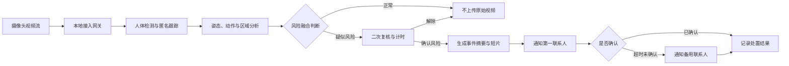
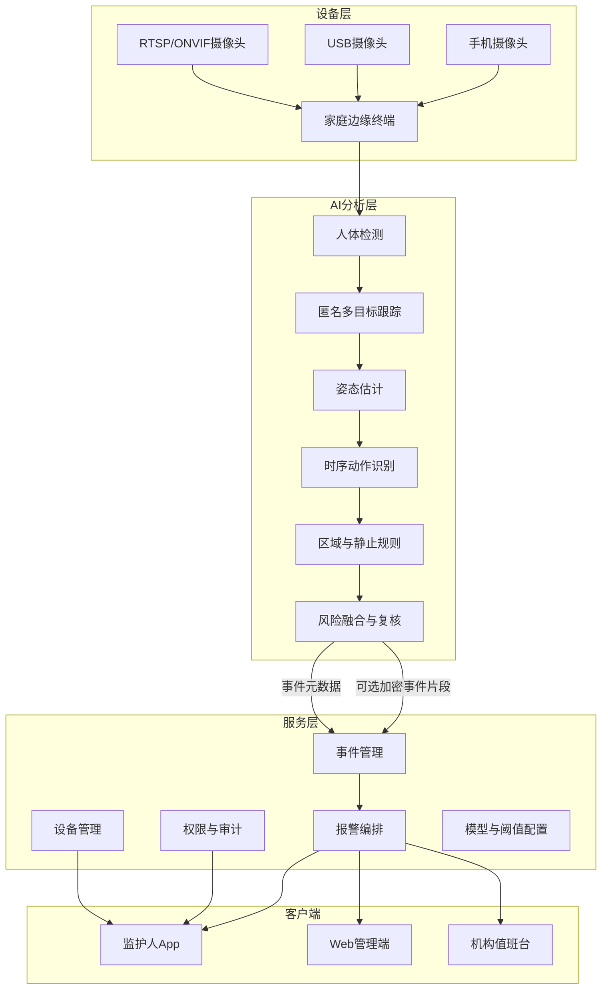

# 项目软件企划书：守望 AI

## 0. 执行摘要

**守望 AI（WatchCare AI）**是一款面向老人、儿童及其他需要远程照护人群的视觉安全辅助软件。软件在获得合法授权后接入家庭或照护机构的摄像头信息流，通过本地优先的计算机视觉模型分析人物姿态、运动轨迹、停留时间和危险区域关系，识别疑似跌倒、长时间倒地、异常静止、离床以及进入危险区域等事件，并通过 App 推送、短信或电话等方式向监护人发出分级报警。

本项目解决的核心问题不是“让监护人随时看摄像头”，而是：

> **当监护人无法持续盯屏时，由软件主动发现高风险事件，压缩从危险发生到监护人知情之间的时间差。**

项目的长期愿景可以覆盖老人和儿童两类人群，但建议首个 MVP 聚焦于：

1. 老人疑似跌倒；
2. 跌倒后的长时间倒地或静止；
3. 进入预设危险区域；
4. 摄像头离线或画面异常。

不建议首版直接承诺识别噎食、癫痫、疾病发作、虐待、情绪异常或全部儿童危险行为。这些事件视觉定义不稳定、误判成本高，并可能涉及医疗器械、未成年人隐私和法律责任问题。

---

## 1. 项目基本定义

### 1.1 产品名称

**中文名称：守望 AI**  
**英文名称：WatchCare AI**

### 1.2 一句话简介

> 在合法授权下接入既有摄像头，通过边缘 AI 实时识别疑似跌倒、长时间倒地和危险区域进入等事件，并向监护人分级报警的远程照护辅助软件。

### 1.3 产品定位

守望 AI 的定位是：

- **远程照护辅助工具**，而不是替代监护人；
- **风险事件检测与通知系统**，而不是医疗诊断系统；
- **本地优先、最小化采集的视频分析系统**，而不是持续上传全部家庭视频的云监控平台；
- **对已有摄像头能力的智能增强层**，而不是必须重新购买全套摄像头硬件的封闭系统。

### 1.4 首要目标用户

| 用户角色 | 典型场景 | 核心需求 |
|---|---|---|
| 异地工作的成年子女 | 老人独居或白天独自在家 | 跌倒后尽快获知，减少频繁查看摄像头 |
| 双职工父母 | 儿童由祖辈、保姆短时照护 | 进入阳台、楼梯、厨房等危险区域时及时提醒 |
| 居家养老服务人员 | 同时服务多个家庭 | 用事件列表代替连续盯屏 |
| 养老机构值班人员 | 多房间、多摄像头管理 | 对高风险事件进行统一排序和闭环处置 |
| 康复期患者家属 | 行动能力暂时受限 | 识别跌倒、离床及长时间静止 |

---

# 2. 现实痛点分析

## 2.1 现状问题

### 2.1.1 高风险事件发生时，监护人通常不在现场

老人独居、白天独自在家、儿童由祖辈或临时照护人员看护等场景中，监护人无法持续处于同一空间。传统家庭摄像头虽然可以提供实时画面和录像回放，但通常要求监护人主动打开 App 查看。

现实中的核心矛盾是：

- 摄像头能够“看见”事件；
- 监护人却不可能全天候“盯住”画面；
- 录像通常只能在事后用于回溯；
- 危险发生到被发现之间可能存在较长空窗期。

因此，单纯“有摄像头”并不等于“有实时风险发现能力”。

### 2.1.2 老人跌倒是高频且后果严重的公共健康问题

世界卫生组织指出，全球每年约有 **68.4 万人因跌倒死亡**，跌倒是全球非故意伤害死亡的第二大原因；每年约有 **3730 万次跌倒严重到需要医疗处理**，且 60 岁以上人群发生致死性跌倒的数量最高。[2]

中国人口老龄化进一步扩大了潜在影响范围。国家统计局发布的《中华人民共和国2025年国民经济和社会发展统计公报》显示：

- 2025 年末，中国 60 岁及以上人口为 **32338 万人**，占总人口 **23.0%**；
- 65 岁及以上人口为 **22365 万人**，占总人口 **15.9%**。[1]

这并不意味着所有老人都需要视频监护，但说明居家安全、跌倒发现和远程照护已经不是少数家庭的边缘需求。

### 2.1.3 儿童意外伤害大量发生在家庭和玩耍场景

中国疾控中心 2026 年发表的一项长沙市人群调查纳入 7087 名 0—5 岁儿童。该研究报告：

- 过去 12 个月非故意伤害发生率为 **9.12%**；
- 跌落占所报告伤害的 **69.2%**；
- 伤害事件主要发生在家中，占 **57.9%**；
- 主要发生于玩耍过程，占 **78.5%**。[3]

需要注意，这是一项长沙市区域研究，不能直接等同于全国发生率，但它能够说明：儿童居家活动、跌落和监护空窗之间存在明确的现实风险。

### 2.1.4 “连续人工看护”不可扩展

对单个家庭而言，持续查看摄像头会造成注意力负担和焦虑；对养老机构或照护平台而言，一名人员同时观察多个画面时，容易出现漏看、延迟处置和责任界定困难。

软件需要将工作模式从：

> 连续观看所有画面

转换为：

> 只在出现高风险事件时查看事件摘要和短视频证据。

---

## 2.2 影响范围

### 2.2.1 直接受影响者

1. 独居老人、行动不便老人和康复期患者；
2. 0—6 岁儿童，尤其是处于探索和攀爬阶段的儿童；
3. 认知功能下降、容易迷失方向或出现异常行为的人群；
4. 无法主动使用手机、手环或紧急按钮的人群。

### 2.2.2 间接受影响者

1. 异地工作或无法全天陪护的家庭成员；
2. 家政、保姆和居家养老服务人员；
3. 养老院、社区照护中心和康复机构；
4. 需要承担安全管理与事件记录责任的运营机构；
5. 发生意外后承担医疗、误工和长期照护成本的家庭。

### 2.2.3 数据支撑汇总

| 数据 | 数值 | 对项目的意义 | 来源 |
|---|---:|---|---|
| 中国 60 岁及以上人口 | 3.2338 亿，占 23.0% | 老年远程照护具有广泛潜在人群 | 国家统计局，2025 年统计公报[1] |
| 中国 65 岁及以上人口 | 2.2365 亿，占 15.9% | 跌倒和居家安全产品面对长期结构性需求 | 国家统计局[1] |
| 全球每年跌倒死亡人数 | 约 68.4 万 | 跌倒属于严重公共健康问题 | WHO[2] |
| 全球每年需医疗处理的跌倒 | 约 3730 万次 | 非致死性伤害同样造成巨大负担 | WHO[2] |
| 长沙 0—5 岁儿童一年非故意伤害发生率 | 9.12% | 儿童居家伤害并非罕见事件 | China CDC Weekly[3] |
| 上述儿童伤害中跌落占比 | 69.2% | 跌落可作为儿童视觉风险识别的重要切入点 | China CDC Weekly[3] |
| 上述儿童伤害发生在家中的比例 | 57.9% | 家庭摄像头和边缘分析具有场景基础 | China CDC Weekly[3] |

---

## 2.3 现有方案的不足

### 2.3.1 普通家庭摄像头：能够录像，但缺少可靠的风险语义

普通摄像头常见能力包括实时观看、录像、移动侦测、人员侦测和声音提醒。然而“画面中有人移动”与“老人跌倒后无法起身”并不是同一个问题。

主要不足包括：

- 移动侦测容易被宠物、光影和正常活动触发；
- 只判断“有人”或“有人移动”，无法理解动作的危险程度；
- 需要监护人主动打开直播；
- 告警信息缺少风险等级、事件原因和处置流程；
- 不同品牌摄像头之间常存在封闭协议和接入壁垒。

### 2.3.2 穿戴设备：依赖佩戴、充电和主动配合

手环、手表和紧急按钮能够覆盖摄像头视野之外的场景，但必须满足“持续佩戴、设备有电、网络正常、佩戴位置正确”等条件。

近期综述指出，穿戴式跌倒检测方案面临用户依从性和潜在误报问题；固定传感器遮挡、忘记佩戴或设备失效，也可能造成漏报或误报。[4][5]

对认知功能下降老人、抗拒佩戴设备的老人和年幼儿童而言，持续佩戴并不能被默认成立。

### 2.3.3 单一阈值或单帧 AI：实验精度高，不代表真实家庭可用

许多研究在公开数据集或模拟跌倒视频上取得较高准确率，但真实家庭环境存在：

- 遮挡；
- 低照度和逆光；
- 摄像头角度差异；
- 人体部分离开画面；
- 快速坐下、躺床、弯腰和跌倒动作相似；
- 老人步态、体型和行动能力差异；
- 儿童活动变化快且动作非标准；
- 真实跌倒样本稀缺。

综述研究指出，快速躺床、快速坐下、上下楼等日常活动可能被误识别为跌倒；真实场景数据不足、个体差异、隐私和误报仍是落地难点。[4]

因此，本项目不能只使用“单帧分类结果大于某个阈值就报警”的简单方案。

### 2.3.4 纯云端视频分析：隐私、带宽和断网风险较高

家庭摄像头可能拍摄卧室、客厅和儿童活动，属于高度敏感的生活数据。若全部视频持续上传云端，将增加：

- 隐私泄露风险；
- 云端存储和带宽成本；
- 网络断开时不可用的风险；
- 用户对被持续观看的抵触；
- 未成年人数据处理的合规压力。

《个人信息保护法》将不满 14 周岁未成年人的个人信息纳入敏感个人信息保护范围，处理此类信息应取得监护人同意并制定专门规则。[6]《未成年人保护法》也要求处理不满 14 周岁未成年人个人信息时取得父母或者其他监护人同意。[7]

因此，本项目必须采用“本地优先、最小上传、权限可撤销、事件可删除”的设计。

### 2.3.5 市场差异化结论

本项目不应宣传为“第一个 AI 跌倒检测产品”，因为市场和研究领域已经存在相关方案。真正可建立的差异化应是：

1. **兼容已有摄像头，而非绑定单一硬件；**
2. **边缘侧优先处理，默认不上传连续原始视频；**
3. **使用姿态、时序、区域和静止时间进行多阶段融合判断；**
4. **提供从发现、复核、通知、确认到升级的报警闭环；**
5. **同时保留老人照护与儿童危险区域识别的扩展能力；**
6. **明确展示“为什么报警”，而不是只输出黑箱分数。**

以上差异化属于产品假设，后续必须通过用户访谈和竞品测试验证，不能直接视为已经成立的市场结论。

---

# 3. 产品／方案描述

## 3.1 产品名称与一句话简介

### 产品名称

**守望 AI（WatchCare AI）**

### 一句话简介

> 一款接入家庭或机构摄像头、在本地实时识别疑似跌倒和危险行为并向监护人分级报警的视觉照护辅助软件。

---

## 3.2 核心功能

### 核心功能一：摄像头接入与本地实时分析

软件通过用户授权接入摄像头视频流，优先支持：

- RTSP；
- ONVIF；
- USB 摄像头；
- 手机摄像头；
- 后续通过厂商 SDK 接入主流智能摄像头。

本地边缘设备或家庭计算终端执行：

- 人体检测；
- 匿名人物跟踪；
- 人体关键点与姿态估计；
- 时序动作分析；
- 危险区域关系判断；
- 长时间静止判断；
- 摄像头离线和画面遮挡检测。

首版原则上不需要做人脸识别。系统使用临时匿名轨迹编号即可，以减少生物识别信息处理。

### 核心功能二：多类型风险识别

首版建议支持以下风险事件：

| 风险事件 | 目标场景 | 实现方式 | MVP优先级 |
|---|---|---|---|
| 疑似跌倒／快速倒地 | 老人、康复患者 | 姿态变化 + 重心下降 + 时序分类 | P0 |
| 长时间倒地或静止 | 老人 | 倒地姿态 + 静止计时 + 二次确认 | P0 |
| 进入危险区域 | 儿童、老人 | 用户绘制多边形区域 + 人物轨迹判断 | P0 |
| 夜间离床 | 老人、康复患者 | 床区离开 + 时段规则 | P1 |
| 异常长时间无活动 | 独居老人 | 活动基线 + 时间阈值 | P1 |
| 攀爬或接近高处边缘 | 儿童 | 姿态 + 区域 + 高度关系 | P1 |
| 摄像头离线／被遮挡 | 所有场景 | 心跳检测 + 画面质量检测 | P0 |
| 噎食、癫痫、疾病发作 | 医疗场景 | 视觉证据不足，需多模态或医疗验证 | 不纳入MVP |
| 虐待、情绪、意图识别 | 高伦理风险场景 | 定义不稳定且法律风险高 | 不纳入当前范围 |

### 核心功能三：分级报警与处置闭环

系统不应只有“发送一条通知”，而应形成事件闭环：

1. 识别疑似风险；
2. 使用第二阶段模型或规则复核；
3. 生成风险等级和事件原因；
4. 保存短时事件片段；
5. 通知第一联系人；
6. 记录是否查看和确认；
7. 超时未确认时通知第二联系人；
8. 由监护人决定是否联系社区、物业或急救机构；
9. 记录最终处置结果，用于模型和阈值优化。

建议的报警等级：

| 等级 | 示例 | 通知方式 | 处置策略 |
|---|---|---|---|
| L1 注意 | 接近危险区域、短暂异常姿态 | App 推送 | 监护人查看即可 |
| L2 高风险 | 疑似跌倒、夜间离床后未返回 | App 强提醒 + 短信 | 要求确认 |
| L3 紧急 | 倒地后长时间无动作、多人复核仍高置信 | App + 电话通知多个联系人 | 人工决定升级救援 |

MVP 阶段不建议系统自动拨打 120。自动呼叫急救涉及误报、责任、地区接口和身份核验问题，宜在后续与专业机构合作后评估。

---

## 3.3 使用流程

### 3.3.1 初次配置流程

1. 监护人注册账号并完成手机号验证；
2. 创建“被照护对象”档案；
3. 阅读隐私说明并取得被照护者或法定监护人授权；
4. 添加摄像头；
5. 检测摄像头画质、角度和网络状态；
6. 在画面中绘制床区、楼梯口、阳台、厨房等危险区域；
7. 选择需要开启的风险检测类型；
8. 设置主联系人、备用联系人和安静时段；
9. 进行模拟测试；
10. 系统通过后进入正式监测状态。

### 3.3.2 日常运行流程

### 3.3.3 监护人收到报警后的流程

报警页面至少展示：

- 风险等级；
- 检测时间；
- 摄像头位置；
- 触发原因；
- 关键帧或经过隐私处理的姿态图；
- 可选事件短视频；
- “无危险”“需要联系”“正在处理”“误报”按钮；
- 联系被照护人、备用联系人或物业的快捷入口。

---

# 4. 产品边界与首版聚焦建议

## 4.1 长期产品愿景

长期可以形成统一的“家庭视觉安全事件平台”，覆盖：

- 老人跌倒和长时间倒地；
- 儿童危险区域和高风险攀爬；
- 康复患者离床；
- 摄像头离线；
- 烟火等环境异常；
- 与门磁、毫米波雷达、手环和烟雾传感器融合。

## 4.2 MVP 不应同时覆盖全部人群和全部危险

老人和儿童虽然都属于需要照护的人群，但其动作模式、风险定义和产品责任并不相同。

| 比较维度 | 老人跌倒 | 儿童危险行为 |
|---|---|---|
| 事件定义 | 相对明确，可结合倒地和长时间静止 | 活动多变，正常玩耍与危险行为边界模糊 |
| 公共数据集 | 相对成熟 | 真实儿童风险数据少且难以开放 |
| 误报来源 | 躺床、坐下、捡物 | 奔跑、翻滚、跳跃、攀爬 |
| 隐私与伦理 | 高 | 更高，涉及未成年人 |
| 处置逻辑 | 联系老人、家属、照护人员 | 通常要求成年人立即介入 |
| 适合首版程度 | 较高 | 建议第二阶段扩展 |

### 4.2.1 首版推荐范围

**首要场景：居家老人跌倒与长时间倒地检测。**

同时保留一个通用功能：

**危险区域进入检测。**

危险区域检测不依赖复杂的“儿童危险动作分类”，可以用于：

- 儿童进入阳台、厨房、楼梯；
- 老人进入不宜单独活动的区域；
- 康复患者离开安全活动区。

这种设计能够保留老人和儿童双场景价值，同时控制首版技术复杂度。

---

# 5. 产品系统架构

## 5.1 总体架构

## 5.2 AI 分析流程

建议采用多阶段模型，而不是单模型直接报警：

1. **人体检测**：确认画面中是否存在人物；
2. **匿名跟踪**：维持连续轨迹，不依赖姓名或人脸；
3. **姿态估计**：提取人体关键点和躯干方向；
4. **时序分析**：判断是否发生快速下降、失衡和倒地；
5. **环境规则**：结合床、地面、楼梯、阳台等区域；
6. **静止确认**：判断倒地后是否长时间无明显动作；
7. **风险融合**：综合多个证据计算等级；
8. **事件复核**：使用更精确但较慢的模型复核疑似片段；
9. **生成解释**：输出“快速倒地 + 躯干接近水平 + 20 秒未起身”等原因。

## 5.3 数据流原则

### 默认处理策略

- 连续原始视频优先在本地处理；
- 云端默认只接收设备状态、风险类型、时间和置信信息；
- 只有发生风险事件时才生成短视频片段；
- 用户可选择完全不上传事件视频，只上传关键点或关键帧；
- 所有上传数据采用加密传输；
- 事件片段设置自动删除期限；
- 用户可以立即删除全部数据和撤销设备权限。

### 建议的数据保留等级

| 等级 | 云端数据 | 适用场景 |
|---|---|---|
| 隐私优先 | 事件类型、时间、匿名关键点 | 卧室等高隐私空间 |
| 标准模式 | 关键帧 + 事件前后短片 | 普通家庭客厅 |
| 机构审计 | 加密事件短片 + 处置记录 | 养老机构或服务平台 |

---

# 6. 功能需求清单

## 6.1 P0：MVP 必须完成

| 模块 | 功能 | 验收要点 |
|---|---|---|
| 账号与权限 | 监护人注册、登录、设备授权、权限撤销 | 未授权用户无法查看设备或事件 |
| 摄像头接入 | 至少支持 RTSP、USB 两种方式 | 可检测在线、离线和重连 |
| 实时分析 | 人体检测、匿名跟踪、姿态分析 | 能在目标硬件上持续运行 |
| 跌倒检测 | 识别疑似快速倒地事件 | 输出事件时间、位置和置信度 |
| 长时间倒地 | 对倒地后的静止进行计时 | 阈值可配置 |
| 危险区域 | 用户可在画面绘制区域 | 进入、停留可分别配置 |
| 二次复核 | 疑似事件不立即进入最高报警 | 降低单帧误报 |
| 报警通知 | App 推送和联系人升级 | 记录发送、送达和确认状态 |
| 事件中心 | 查看关键帧、短片、原因和处置状态 | 支持标记误报 |
| 设备异常 | 离线、遮挡、画面冻结提醒 | 避免“系统失效但用户不知道” |
| 隐私设置 | 关闭上传、删除事件、设置保存期 | 默认采用最小化采集 |
| 审计日志 | 记录谁查看、下载或删除事件 | 支持追责和合规检查 |

## 6.2 P1：首轮试点后扩展

- 夜间离床；
- 异常长时间无活动；
- 多摄像头统一管理；
- 多联系人值班表；
- 语音询问“是否需要帮助”；
- 事件关键点隐私模式；
- 模型个性化阈值；
- 机构版事件队列；
- 与门磁、烟雾传感器或毫米波雷达融合。

## 6.3 P2：成熟阶段

- 多品牌摄像头厂商 SDK；
- 机构级多租户；
- 联邦学习或隐私保护模型更新；
- 行为基线与风险趋势；
- 与社区养老服务平台对接；
- 经严格验证后的儿童攀爬检测；
- 经合作审批后的急救、物业或护理机构接口。

---

# 7. 非功能需求

## 7.1 实时性

- 正常网络下，风险发生到首条通知的 P95 延迟目标不高于 10 秒；
- 长时间倒地类事件的延迟由用户配置的确认时间决定；
- 摄像头断线后 30 秒内发现并提示。

以上为项目目标值，不是当前已实现能力。

## 7.2 可用性

- 家庭用户应在 15 分钟内完成单摄像头配置；
- 老年监护场景应支持大字体和一键确认；
- 报警原因应使用自然语言，不只显示模型分数；
- App 必须清楚区分“疑似风险”和“已人工确认”。

## 7.3 兼容性

首版建议优先支持标准协议，不应一开始接入大量厂商私有协议：

1. RTSP；
2. ONVIF；
3. USB/UVC；
4. 本地视频文件测试模式。

## 7.4 安全性

- 传输加密；
- 本地密钥保护；
- 账号二次验证；
- 摄像头凭据加密保存；
- 最小权限；
- 事件下载水印；
- 查看与导出审计；
- 设备远程解绑；
- 安全更新与漏洞响应机制。

---

# 8. MVP 验收指标

## 8.1 技术指标

以下指标是立项目标，需要通过真实测试验证：

| 指标 | 受控测试目标 | 真实家庭试点目标 |
|---|---:|---:|
| 跌倒事件召回率 | ≥95% | ≥90% |
| 跌倒事件精确率 | ≥90% | ≥85% |
| 平均误报警频率 | ≤0.2 次／摄像头·天 | ≤0.5 次／摄像头·天 |
| 报警端到端延迟 P95 | ≤8 秒 | ≤10 秒 |
| 摄像头在线状态识别 | ≥99% | ≥99% |
| 事件通知送达率 | ≥99% | ≥99% |
| 事件原因可解释覆盖率 | 100% | 100% |

真实家庭试点中的指标应按摄像头角度、光照、遮挡、老人行动能力分别统计，不能只报告总体准确率。

## 8.2 产品指标

- 设备首次配置成功率；
- 7 日和 30 日活跃家庭数；
- 每日有效风险事件数；
- 误报标记率；
- 报警查看率；
- 报警确认时间中位数；
- 联系人升级比例；
- 用户关闭摄像头或关闭检测的比例；
- 用户对隐私设置的理解度。

## 8.3 安全价值指标

最终不能只证明“模型分类准确”，还应验证：

- 是否缩短危险事件发现时间；
- 是否提升监护人确认速度；
- 是否减少无效查看摄像头的次数；
- 是否让用户在可接受隐私代价下持续使用；
- 是否避免因误报过多产生告警疲劳。

---

# 9. 隐私、伦理与合规要求

## 9.1 合法授权

接入摄像头前必须确认：

- 摄像头的所有者或管理者有权授权；
- 被照护成年人已经知情并同意，或存在合法代理安排；
- 涉及未成年人时由父母或其他法定监护人同意；
- 不得拍摄邻居住宅、公共通道中的非必要区域或其他无关人员的私密空间；
- 机构场景需要单独评估告知、授权、员工管理和公共视频系统规定。

## 9.2 未成年人保护

处理不满 14 周岁未成年人信息时，产品至少需要：

1. 监护人单独同意；
2. 专门的儿童隐私政策；
3. 默认最短保存期；
4. 不使用儿童视频进行广告画像；
5. 未经再次授权不得将视频用于模型训练；
6. 提供删除和导出机制；
7. 限制内部员工访问；
8. 对模型训练数据进行去标识化和严格审核。

## 9.3 隐私优先设计

- 默认关闭人脸识别；
- 默认不进行身份推断、情绪推断和健康诊断；
- 默认不持续上传完整视频；
- 尽可能上传人体关键点或经过模糊化处理的证据；
- 摄像头放置引导应避开卫生间、更衣等高度私密区域；
- 用户应能看到“系统当前正在分析什么”；
- 每次数据用途变化都需要重新告知和授权。

## 9.4 公共与机构视频场景

中国自 2025 年 4 月 1 日起施行《公共安全视频图像信息系统管理条例》，进一步强调视频系统建设、使用和个人隐私保护。[8]

该条例主要针对公共安全视频图像信息系统，不应简单等同于普通家庭室内摄像头规则；但养老机构、公共区域和商业部署需要在上线前由专业人员完成适用性评估。

## 9.5 产品责任声明

产品界面和服务条款应明确：

- 系统只能降低漏发现风险，不能保证发现所有危险；
- 模型输出是“疑似风险”，不构成医疗诊断；
- 用户应保持合理的人工照护和环境安全措施；
- 断电、断网、遮挡、摄像头损坏可能导致服务失效；
- 高风险对象不能仅依赖本软件进行生命安全保障。

---

# 10. 主要风险与应对方案

| 风险 | 影响 | 应对方案 |
|---|---|---|
| 漏报真实跌倒 | 可能延误救助，属于最高优先级风险 | 多阶段检测、长时间静止补充、设备异常报警、真实试点 |
| 误报过多 | 用户关闭通知，形成告警疲劳 | 二次复核、个性化阈值、事件反馈、分级报警 |
| 遮挡和低照度 | 模型无法稳定识别人 | 安装引导、画面质量检测、红外或多传感器扩展 |
| 摄像头协议碎片化 | 接入成本高 | 首版聚焦 RTSP/ONVIF/USB，建立适配层 |
| 网络中断 | 云端报警失效 | 本地推理、本地声光提示、断线缓存、备用通信 |
| 隐私泄露 | 造成严重信任和法律风险 | 本地优先、最小上传、加密、审计、短期保存 |
| 儿童数据合规不足 | 无法合法上线 | 监护人同意、专门规则、训练数据隔离 |
| 实验数据与真实场景差异 | 公开数据集高分但家庭不可用 | 家庭试点、按场景分层评估、收集困难样本 |
| 自动报警责任不清 | 误呼救或无人响应 | MVP 采用联系人闭环，不自动拨打急救电话 |
| 产品范围过大 | 无法在有限时间内完成 | 首版聚焦老人跌倒、长时间倒地和危险区域 |

---

# 11. 项目实施路线

## 11.1 阶段 0：需求验证与合规预研

**周期建议：2—3 周**

工作内容：

- 访谈 10—20 个家庭；
- 访谈养老服务人员或社区工作者；
- 梳理现有摄像头类型；
- 明确首版安装位置；
- 验证用户对本地处理和事件短片的接受度；
- 完成隐私数据流图；
- 完成竞品功能矩阵；
- 冻结 MVP 边界。

验收标准：

- 至少确认三个重复出现的真实痛点；
- 至少有五个潜在试点家庭愿意参与后续测试；
- 明确数据采集、告知、同意和删除流程；
- 形成可执行的产品需求文档。

## 11.2 阶段 1：技术原型

**周期建议：4—6 周**

工作内容：

- 完成 RTSP/USB 视频接入；
- 完成人体检测与姿态估计；
- 完成基础跌倒时序规则；
- 完成危险区域绘制；
- 完成本地事件生成；
- 建立离线测试集；
- 输出准确率、召回率和混淆矩阵。

验收标准：

- 能够在一台目标设备上连续运行；
- 能正确处理摄像头断线和重连；
- 模拟跌倒和正常躺下能够被区分；
- 所有测试视频拥有可复现结果。

## 11.3 阶段 2：MVP 软件

**周期建议：6—8 周**

工作内容：

- 开发监护人 App 或响应式 Web；
- 完成用户、设备、联系人和事件管理；
- 完成消息推送；
- 完成事件确认和升级；
- 完成隐私设置和审计日志；
- 完成安全测试；
- 完成模型版本管理。

验收标准：

- 从摄像头接入到报警确认全流程可用；
- 用户能够删除数据和撤销权限；
- 事件拥有明确原因；
- 系统可以统计漏报、误报和延迟。

## 11.4 阶段 3：小规模真实家庭试点

**周期建议：8—12 周**

建议规模：

- 10—30 个家庭；
- 每个家庭 1—2 个摄像头；
- 先采用模拟风险事件加日常自然运行；
- 逐步引入不同光照、角度和房型。

验收标准：

- 完成真实误报频率统计；
- 完成用户接受度和隐私反馈；
- 发现并修复主要摄像头兼容问题；
- 达到本企划书第 8 节设定的最低试点目标，或给出明确改进计划。

## 11.5 阶段 4：儿童危险区域扩展

只有在老人场景 MVP 达到可用水平后再开展：

- 儿童危险区域进入；
- 楼梯、阳台、厨房和门口场景；
- 儿童奔跑、攀爬等困难样本调研；
- 未成年人数据专门治理；
- 儿童场景独立验收，不与老人跌倒指标混合。

---

# 12. 商业模式初步设想

## 12.1 B2C 家庭版

可能的收费结构：

- 基础版：单摄像头、危险区域、基础通知；
- 标准版：跌倒识别、多联系人、事件短片；
- 高级版：多摄像头、电话通知、本地边缘盒子。

## 12.2 B2B／B2B2C 机构版

目标客户：

- 居家养老服务商；
- 社区养老中心；
- 养老机构；
- 康复机构；
- 智能摄像头厂商；
- 智慧社区平台。

可提供：

- 按设备订阅；
- 私有化部署；
- SDK/API 授权；
- 机构值班台；
- 事件审计和服务工单。

## 12.3 商业化前提

在商业化之前，必须证明：

1. 真实家庭误报在可接受范围；
2. 告警确实能够缩短发现时间；
3. 用户愿意授权并持续使用；
4. 摄像头接入成本不会吞噬收入；
5. 数据处理和运营流程符合法律要求；
6. 保险、医疗或急救相关宣传没有夸大产品能力。

---

# 13. 团队与角色建议

最小可行团队建议包括：

| 角色 | 主要职责 |
|---|---|
| 产品负责人 | 场景定义、需求边界、试点组织 |
| 计算机视觉工程师 | 检测、姿态、时序模型和评估 |
| 后端工程师 | 设备、事件、权限、通知和审计 |
| 前端／移动端工程师 | 配置、报警和事件中心 |
| 边缘计算工程师 | 视频接入、性能优化和部署 |
| 测试工程师 | 功能、兼容性、场景和回归测试 |
| 安全／合规顾问 | 隐私、安全和未成年人数据治理 |

早期团队人数有限时，可以合并角色，但不能省略安全、数据治理和真实场景测试职责。

---

# 14. 项目最终判断

本项目具有明确的现实需求和社会价值，老人跌倒、儿童居家伤害和监护人无法持续盯屏构成了真实痛点。现有摄像头、穿戴设备和单一 AI 模型分别存在主动查看、佩戴依从性、误报、遮挡和隐私等限制。

项目可行，但成功的关键不在于简单训练一个“跌倒／非跌倒”分类模型，而在于建立完整系统：

> **标准化摄像头接入 + 本地多阶段风险识别 + 事件解释 + 分级通知 + 人工确认 + 权限审计 + 真实家庭验证。**

建议采用以下立项结论：

- **产品愿景**：覆盖老人和儿童等远程照护场景；
- **首版主场景**：老人跌倒与长时间倒地；
- **首版通用能力**：危险区域进入和设备异常；
- **儿童场景策略**：先做区域规则，后做复杂动作识别；
- **技术原则**：边缘计算优先、多阶段复核、可解释报警；
- **隐私原则**：最小采集、默认无持续云端视频、人脸识别非必需；
- **责任原则**：辅助监护，不替代人工照护，不做医疗诊断；
- **验证原则**：真实家庭指标优先于公开数据集准确率。

---

# 15. 参考资料

[1] 国家统计局：《中华人民共和国2025年国民经济和社会发展统计公报》，2026-02-28。  
https://www.stats.gov.cn/sj/zxfb/202602/t20260228_1962662.html

[2] World Health Organization, “Falls,” Fact Sheet, 2021-04-26。  
https://www.who.int/news-room/fact-sheets/detail/falls

[3] Jing, Y., Yuan, Y., Liu, D., Li, L., & Hu, G. “Unintentional Injury Incidence Among Children Aged 0–5 Years — Changsha City, Hunan Province, China, 2024–2025.” *China CDC Weekly*, Vol. 8, No. 15, 2026。  
https://weekly.chinacdc.cn/ys/en/article/pdf/preview/0e7650eb-83ac-4a5c-b767-d1436b85cbfa.pdf

[4] Band, S. S., et al. “A Review on AI Approaches in Elderly Fall Monitoring Systems: Taxonomies, Challenges, and Open Issues.” *Cognitive Computation*, 2025。  
https://link.springer.com/article/10.1007/s12559-025-10532-z

[5] Badade, V., Ove, S., Chikode, P., Deshpande, M., & Kadam, B. “A Review on Fall Detection Techniques for Elderly People with Video Surveillance.” *Lecture Notes in Electrical Engineering*, Vol. 1469, Springer, 2026。  
https://doi.org/10.1007/978-981-95-0705-4_8

[6] 《中华人民共和国个人信息保护法》，最高人民检察院网站转载。  
https://www.spp.gov.cn/zdgz/202108/t20210820_527240.shtml

[7] 《中华人民共和国未成年人保护法》，最高人民检察院。  
https://www.spp.gov.cn/spp/fl/202010/t20201018_482257.shtml

[8] 司法部：《李强签署国务院令公布〈公共安全视频图像信息系统管理条例〉》，2025-02-10。  
https://www.moj.gov.cn/pub/sfbgw/gwxw/xwyw/202502/t20250210_514097.html
